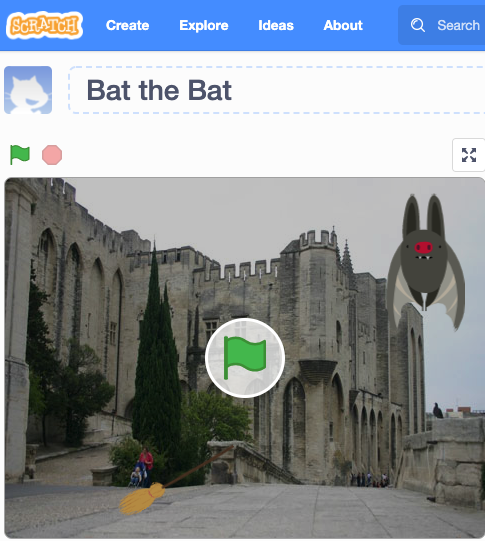

# README Generator
    
# Description: 

It creates a readme file.
    
# Table of Contents: 

* [Installation](#installation)
* [Usage](#usage)
* [Contributing](#contributing)
* [License](#license)
* [Tests](#tests)
* [Questions](#questions)
* [Link](#link)
* [Image](#image)

    
## Installation: 

To install the needed dependencies, please run the following command: npm i
    
## Usage: 
    
Special instructions for usage: Nothing
    
## License: 
    
This project is licensed under the MIT license(s).
    
## Contributing: 

Nothing
    
## Tests: 

Be sure to run the following test(s): npm test
    
## Questions: 
    
If you have any questions, please reach out to  **<a href="https://github.com/BrianSoldani">BrianSoldani</a>** or email me here: briansoldani@gmail.com

## Link: 

homework.com

## Image:

